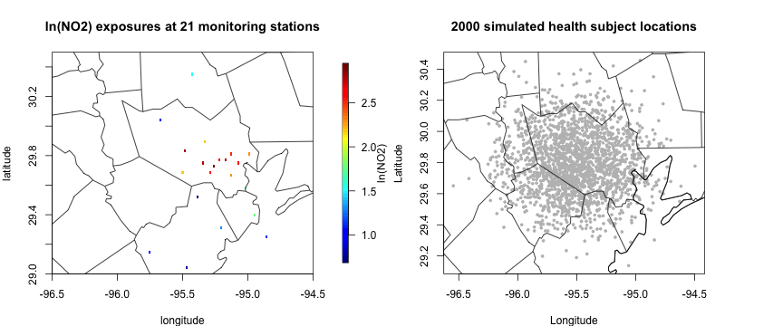
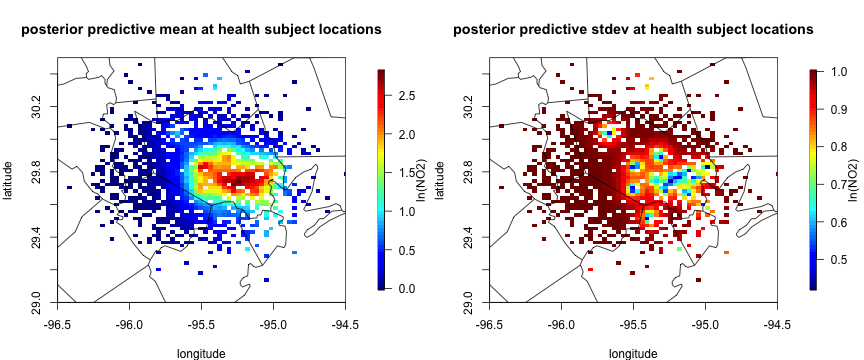

This is a vignette for the `bspme` package based on January 2012 daily average NO2 data in Harris County, Texas and a simulated health dataset.

First load the package and data:


```r
rm(list=ls())
library(bspme)
library(fields) # for spatial distance calculation and covariance functions
library(maps) # plotting tool
data("NO2_Jan2012")
data("health_sim")
```
The daily average NO2 data are collected from 21 monitoring sites in and around the Harris County, Texas during Jan 2012. We focus on NO2 exposure on a specific date (Jan 10th, 2012) for an illustration purpose. We also consider a simulated health dataset with $n=2000$ subject locations and continuous health outcomes.


```r
data_jan10 = NO2_Jan2012[NO2_Jan2012$date == as.POSIXct("2012-01-10"),]
par(mfrow = c(1,2), mar = c(4, 4, 4, 6))
quilt.plot(cbind(data_jan10$lon, data_jan10$lat),
            data_jan10$lnNO2, main = "ln(NO2) exposures at 21 monitoring stations",
            xlab = "longitude", ylab= "latitude", xlim = c(-96.5, -94.5), ylim = c(29, 30.5), legend.lab = "ln(NO2)")
maps::map("county", "Texas", add = T)
plot(health_sim$lon, health_sim$lat, pch = 19, cex = 0.5, col = "grey",
     xlab = "Longitude", ylab = "Latitude", main = "2000 simulated health subject locations"); US(add = T)
maps::map("county", "Texas", add = T)
```

<div class="figure">

<p class="caption"> </p>
</div>

### Obtain posterior predictive distribution at health subject locations

In this example, we will use a Gaussian process to obtain a predictive distribution of $(X_1,\dots,X_n)$ for the ln(NO2) exposure at health subject locations. The posterior predictive distribution (ppd) is an n-dimensional multivariate normal $N(\mu_X, Q_X^{-1})$, which will be used as a prior to incorporate the prediction uncertainty and spatial correlation in  NO2 exposures at health subject locations in the estimation of the health model. Specifically, we will use the exponential covariance kernel with a fixed range of 8 (in km) and standard deviation 1.


```r
coords_monitor = cbind(data_jan10$lon, data_jan10$lat)
coords_health = cbind(health_sim$lon, health_sim$lat)
a = 8; sigma = 1; # assume known
# distance calculation
distmat_xx <- rdist.earth(coords_monitor, miles = F)
distmat_xy <- rdist.earth(coords_monitor, coords_health, miles = F)
distmat_yy <- rdist.earth(coords_health, miles = F)

# GP covariance matrices
Sigmaxx = fields::Matern(distmat_xx, smoothness = 0.5, range = a, phi = sigma^2)
Sigmaxy = fields::Matern(distmat_xy, smoothness = 0.5, range = a, phi = sigma^2)
Sigmayy = fields::Matern(distmat_yy, smoothness = 0.5, range = a, phi = sigma^2)

# posterior predictive mean and covariance
X_mean <- t(Sigmaxy) %*% solve(Sigmaxx, data_jan10$lnNO2)
X_cov <- Sigmayy - t(Sigmaxy) %*% solve(Sigmaxx,Sigmaxy) # n_y by n_y

# visualization of posterior predictive distribution. Black triangle is monitoring station locations.
par(mfrow = c(1,2), mar = c(4, 4, 4, 6))
quilt.plot(cbind(health_sim$lon, health_sim$lat),
          X_mean, main = "posterior predictive mean at health subject locations",
          xlab = "longitude", ylab= "latitude", xlim = c(-96.5, -94.5), ylim = c(29, 30.5), legend.lab = "ln(NO2)")
maps::map("county", "Texas", add = T)
# posterior predictive sd of exposure at health data
quilt.plot(cbind(health_sim$lon, health_sim$lat),
          sqrt(diag(X_cov)), main = "posterior predictive stdev at health subject locations",
          xlab = "longitude", ylab= "latitude", xlim = c(-96.5, -94.5), ylim = c(29, 30.5), legend.lab = "ln(NO2)")
maps::map("county", "Texas", add = T)
```

<div class="figure">

<p class="caption"> </p>
</div>

The covariance of $(X_1,\dots,X_n)$ contains all spatial dependency information up to a second order, but the precision matrix (inverse covariance matrix) $Q_X$ is a dense matrix.
When it comes to fitting the Bayesian linear model with spatial exposure measurement error, the naive implementation with an n-dimensional multivariate normal prior $N(\mu_X, Q_X^{-1})$ takes cubic time complexity of posterior inference for each MCMC iteration, which becomes infeasible to run when $n$ is large such as tens of thousands.


### Run Vecchia approximation to get sparse precision matrix

We propose to use a Vecchia approximation to get a new multivariate normal prior of $(X_1,\dots,X_n)$ with a sparse precision matrix, which is crucial for the scalable implementation of health models with spatial exposure measurement error while preserving the spatial dependency information in the original covariance matrix as closely as possible.


```r
#Run the Vecchia approximation to get the sparse precision matrix.

# Vecchia approximation
run_vecchia = vecchia_cov(X_cov, coords = cbind(health_sim$lon, health_sim$lat),
            n.neighbors = 10)
Q_sparse = run_vecchia$Q
run_vecchia$cputime
#> Time difference of 0.5541399 secs
```


### Fit bspme with sparse precision matrix

We can now fit the main function of the bspme package with a sparse precision matrix.


```r
# fit the model
fit_me = blm_me(Y = health_sim$Y,
              X_mean = X_mean,
              X_prec = Q_sparse, # sparse precision matrix
              Z = health_sim$Z,
              nburn = 100, # increase as needed
              nsave = 1000, # increase as needed
              nthin = 1) # increase as needed
```

```r
fit_me$cputime
#> Time difference of 6.949046 secs
```
It takes less than 10 seconds to (1) run the Vecchia approximation and (2) run the MCMC algorithm with a total of 1100 iterations (on a Macbook M1 max CPU with 64GB of memory).


```r
summary(fit_me$posterior) # posterior summary
#> 
#> Iterations = 1:1000
#> Thinning interval = 1 
#> Number of chains = 1 
#> Sample size per chain = 1000 
#> 
#> 1. Empirical mean and standard deviation for each variable,
#>    plus standard error of the mean:
#> 
#>                Mean      SD Naive SE Time-series SE
#> (Intercept)  0.7490 0.08557 0.002706       0.012488
#> exposure.1  -1.9544 0.05068 0.001603       0.007311
#> covariate.1  2.9578 0.04151 0.001313       0.003219
#> sigma2_Y     0.9546 0.14537 0.004597       0.029898
#> 
#> 2. Quantiles for each variable:
#> 
#>                2.5%     25%     50%     75%   97.5%
#> (Intercept)  0.5882  0.6911  0.7466  0.8024  0.9289
#> exposure.1  -2.0437 -1.9883 -1.9556 -1.9218 -1.8421
#> covariate.1  2.8702  2.9305  2.9584  2.9863  3.0382
#> sigma2_Y     0.6677  0.8498  0.9593  1.0553  1.2473
```

### Fit bspme without sparse precision matrix (slow)

As mentioned above, if the precision matrix is dense, the posterior computation becomes infeasible when $n$ is large, such as tens of thousands. See the following example when $n=2000$.


```r
# fit the model, without vecchia approximation
# I will only run 11 iteration for illustration purpose
Q_dense = solve(X_cov) # inverting 2000 x 2000 matrix, takes some time
# run
fit_me_dense = blm_me(Y = health_sim$Y,
                X_mean = X_mean,
                X_prec = Q_dense, # dense precision
                Z = health_sim$Z,
                nburn = 1, # Running only 11 iterations for an illustration purpose
                nsave = 10, # Running only 11 iterations for an illustration purpose
                nthin = 1) # Running only 11 iterations for an illustration purpose
```

```r
fit_me_dense$cputime
#> Time difference of 16.86512 secs
```

Even with only 11 MCMC iterations, it takes about 15 seconds to run the MCMC algorithm. With the same number of iterations as before (1100), it will take about 1500 seconds (i.e. 25 minutes) to run the MCMC algorithm.
This gap becomes much larger when the number of health subject locations grows, such as tens of thousands. Then, the naive algorithm which uses a dense precision matrix becomes infeasible, but we can carry out the inference using the Vecchia approximation.

The quality of the Vecchia approximation depends on the size of the nearest neighbors, which is controlled by the argument `n.neighbors` in the `vecchia_cov` function. The larger the `n.neighbors`, the better the approximation. The simulation study of Lee et al. (2024) demonstrates that a Vecchia approximation with a relatively small `n.neighbors` can provide a scalable two-stage Bayesian inference method of which results (e.g. RMSE, empirical coverage) are close to those based on the dense precision matrix or a fully Bayesian analysis.

## References

Lee, C. J., Symanski, E., Rammah, A., Kang, D. H., Hopke, P. K., & Park, E. S. (2024). A scalable two-stage Bayesian approach accounting for exposure measurement error in environmental epidemiology. arXiv preprint arXiv:2401.00634.


